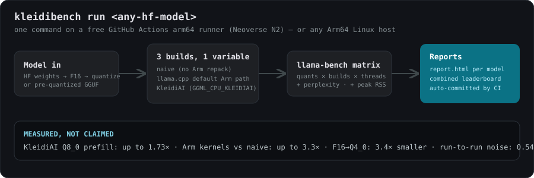
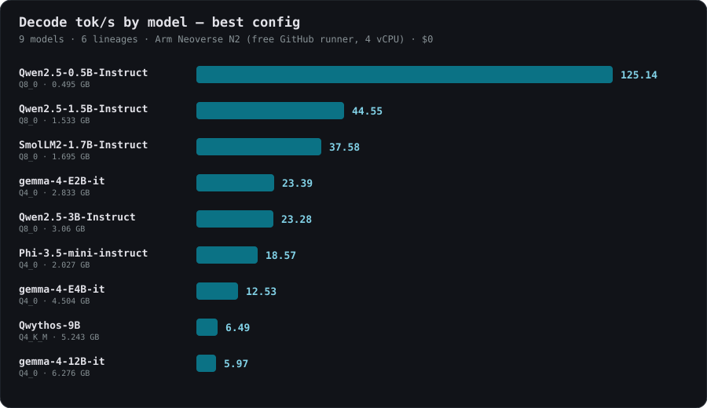
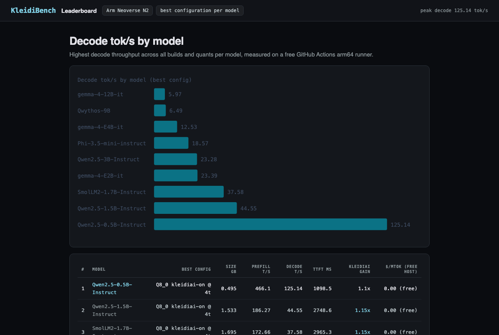
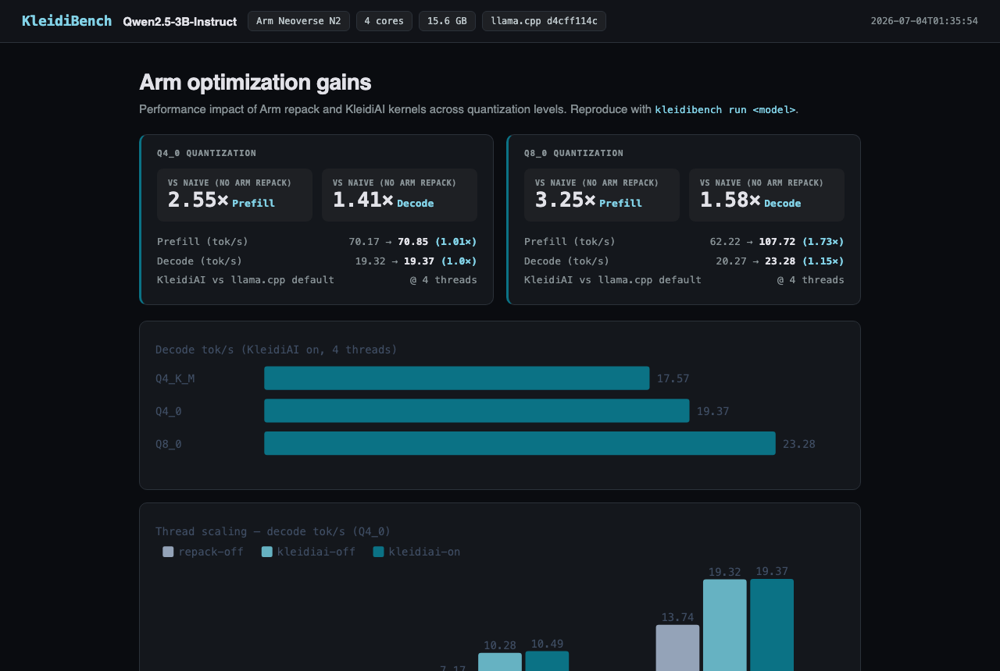
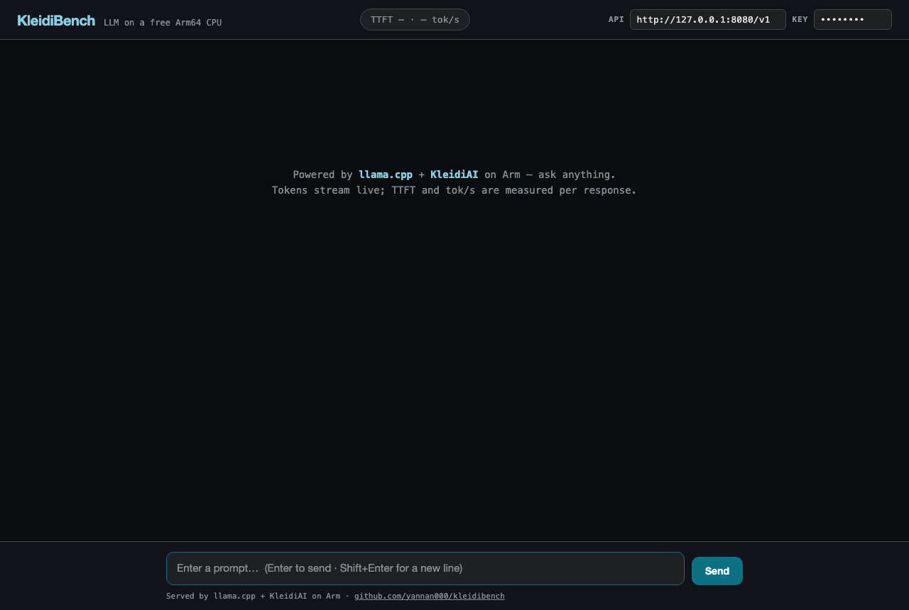
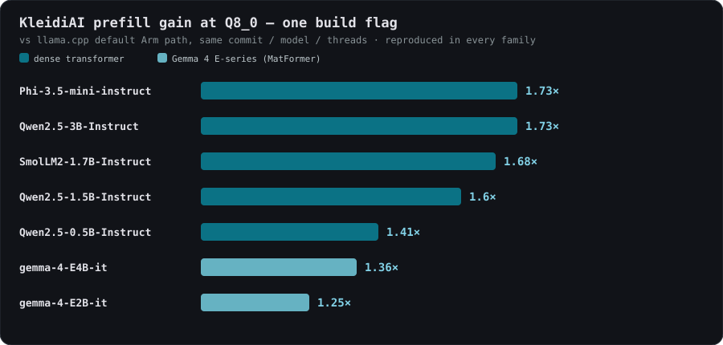

# KleidiBench

[](https://github.com/yannan000/kleidibench/actions/workflows/benchmark.yml)

**"Should we run this LLM on Arm — and how?" Answered in one free CI run:
a serving decision (quant, build, RAM, quality cost, $/Mtok), not just a number.**

KleidiBench takes any Hugging Face LLM, builds `llama.cpp` **three ways** — naive,
default Arm path, and Arm's [KleidiAI](https://gitlab.arm.com/kleidi/kleidiai)
micro-kernels — benchmarks every (quant × build × threads) combination on an Arm64
CPU, and emits reproducible **dashboard-style reports**: size, prefill/decode
tok/s, TTFT, peak RAM, perplexity, and cost-per-million-tokens.

Everything below ran on **free GitHub Actions arm64 runners** (`ubuntu-24.04-arm`,
real Neoverse N2 silicon, free for public repos). No GPU. No cloud account. $0.

> Submission for the **Arm Create: AI Optimization Challenge 2026**, Track 2 (Cloud AI).



---

## The results — 9 models, 6 lineages, 0.5B → 12B

Every row measured on the same free runner; full sweeps (all quants, all three
builds, thread scaling, perplexity) in [results/](results/).



| # | Model | Best config | Size (GB) | Prefill t/s | Decode t/s | $/Mtok |
|--:|-------|-------------|----------:|------------:|-----------:|-------:|
| 1 | Qwen2.5-0.5B-Instruct | Q8_0 · KleidiAI @ 4t | 0.50 | 466.1 | **125.1** | 0.00 (free) |
| 2 | Qwen2.5-1.5B-Instruct | Q8_0 · KleidiAI @ 4t | 1.53 | 186.3 | 44.6 | 0.00 (free) |
| 3 | SmolLM2-1.7B-Instruct | Q8_0 · KleidiAI @ 4t | 1.70 | 172.7 | 37.6 | 0.00 (free) |
| 4 | gemma-4-E2B-it | Q4_0 @ 4t | 2.83 | 46.2 | 23.4 | 0.00 (free) |
| 5 | Qwen2.5-3B-Instruct | Q8_0 · KleidiAI @ 4t | 3.06 | 107.7 | 23.3 | 0.00 (free) |
| 6 | Phi-3.5-mini-instruct | Q4_0 · KleidiAI @ 4t | 2.03 | 54.4 | 18.6 | 0.00 (free) |
| 7 | gemma-4-E4B-it | Q4_0 @ 4t | 4.50 | 28.0 | 12.5 | 0.00 (free) |
| 8 | Qwythos-9B *(HF #1 trending)* | Q4_K_M · KleidiAI @ 4t | 5.24 | 21.6 | 6.5 | 0.00 (free) |
| 9 | gemma-4-12B-it | Q4_0 · KleidiAI @ 4t | 6.28 | 16.4 | 6.0 | 0.00 (free) |

The **Gemma 4 ladder (E2B/E4B/12B) and Qwythos-9B were benchmarked days after
release** — before HF→GGUF converter support existed — via KleidiBench's
pre-quantized GGUF mode. New architecture ships → you get Arm numbers the same day.

**Live dashboards (GitHub Pages):**

| [📊 Interactive leaderboard](https://yannan000.github.io/kleidibench/results/leaderboard.html) | [📈 3B deep-dive report](https://yannan000.github.io/kleidibench/results/Qwen2.5-3B-Instruct/report.html) |
|:--:|:--:|
| [](https://yannan000.github.io/kleidibench/results/leaderboard.html) | [](https://yannan000.github.io/kleidibench/results/Qwen2.5-3B-Instruct/report.html) |

| [💬 Chat demo UI — live TTFT / tok-s per response](https://yannan000.github.io/kleidibench/demo/chat.html) |
|:--:|
| [](https://yannan000.github.io/kleidibench/demo/chat.html) |

---

## The headline finding: KleidiAI's real win is Q8_0



Most on/off benchmarks test Q4_0 and conclude KleidiAI does ~nothing (1.01×) —
because llama.cpp's **default** build already ships equivalent Arm repack kernels
there. The flag's true win is **Q8_0, where the default path doesn't repack**:
up to **1.73× prefill from one CMake flag**, reproduced across every family we
measured. Only a 3-way comparison (naive / default / KleidiAI) makes both facts
visible — that's why KleidiBench builds llama.cpp three times.

Deep-dive on Qwen2.5-3B (F16 baseline + quality):

| Config | Size (GB) | Prefill t/s | Decode t/s | Peak RAM (GB) | Perplexity |
|--------|----------:|------------:|-----------:|--------------:|-----------:|
| F16 | 5.75 | 23.4 | 10.9 | 5.9 | 16.88 |
| Q4_0 — naive (no Arm repack) | 1.70 | 27.9 | 14.0 | 1.9 | 20.27 |
| Q4_0 — llama.cpp default Arm path | 1.70 | 70.2 | 19.3 | 3.5 | 20.27 |
| Q4_0 — **KleidiAI** | 1.70 | 70.9 | 19.4 | 3.5 | 20.27 |
| Q8_0 — KleidiAI **off** | 3.06 | 62.2 | 20.3 | 6.3 | 17.11 |
| Q8_0 — **KleidiAI on** | 3.06 | **107.7** | **23.3** | 6.1 | **17.11** |

Six measured findings, with serving guidance (the ~3B decode crossover, repack's
2× RAM cost, the 0.54% CI noise floor, and more):
**[docs/FINDINGS.md](docs/FINDINGS.md)**.

---

## Quick start

No Arm hardware required — push to GitHub and the free `ubuntu-24.04-arm`
runner does the rest:

```bash
gh repo create kleidibench --public --source=. --remote=origin --push
# Actions tab -> "benchmark" runs automatically on every push (smoke test)
# Actions tab -> "benchmark" -> Run workflow -> the real sweep, commits results/
# Actions tab -> "demo-session" -> Run workflow -> private SSH session to record the live demo
```

Prefer to run it yourself on any Arm64 Linux box?

```bash
git clone <this-repo> && cd kleidibench
python3 -m pip install -e .
kleidibench run Qwen/Qwen2.5-3B-Instruct   # ungated, no HF login needed
# -> results/<model>/report.md + report.html
kleidibench sweep configs/leaderboard.yaml # multi-model leaderboard
```

Models too big to convert on the host (or too new for the converter)? Point a
config at community GGUFs instead — see `configs/gemma4-12b.yaml`.

See [docs/setup.md](docs/setup.md) for the full walk-through and
[docs/methodology.md](docs/methodology.md) for how every number is measured
(including the measured run-to-run noise floor: **0.54% median**).

---

## Why it should win

- **Measurable optimization, not vibes.** Every claim is a `llama-bench` number,
  reproducible with one command on a free Arm runner — and the run-to-run noise
  is itself measured.
- **Honest methodology that found things.** The 3-way build design surfaced the
  Q8_0/Q4_0 asymmetry, the ~3B decode crossover, and repack's 2× RAM cost —
  findings an on/off benchmark structurally cannot see.
- **A reusable artifact.** Point it at *your* model — including day-one
  architectures via pre-quantized GGUFs — and get *your* Arm numbers.
- **Genuinely $0.** Fork → push → CI hands you a benchmark dashboard.

---

## What it does

```
kleidibench run <hf-model>
    │
    ├─ build.py     clone llama.cpp, cmake 3 builds: naive / default Arm / KleidiAI
    ├─ quantize.py  convert HF -> GGUF, quantize to Q8_0 / Q4_K_M / Q4_0
    │               (or download pre-quantized GGUFs for day-one/oversize models)
    ├─ bench.py     run llama-bench per (build × quant × threads), parse tok/s + RAM
    ├─ quality.py   (--quality) perplexity per quant on a bundled corpus
    ├─ perfix.py    (optional) capture Arm Performix profile
    └─ report.py    emit results/<model>/report.{md,html} + combined leaderboard
```

## Repo layout

| Path | What |
|------|------|
| `kleidibench/` | the harness (Python, dependency-light) |
| `configs/` | sweep definitions (models, quant list, threads, quality) |
| `demo/` | OpenAI-compatible endpoint on the Arm runner + browser chat UI ([chat.html](demo/chat.html)) with live TTFT/tok-s stats |
| `results/` | committed benchmark artifacts — dashboards, tables, leaderboard |
| `.github/workflows/` | `benchmark.yml` (CI smoke test + full sweep, parallel-dispatch safe), `demo-session.yml` (live SSH for the demo video) |
| `docs/` | findings, setup, methodology, submission text, video storyboard |
| `scripts/` | provisioning helper for an optional persistent Arm box (Oracle) |

## License

MIT — see [LICENSE](LICENSE).

## Author

Yoofi Annan
